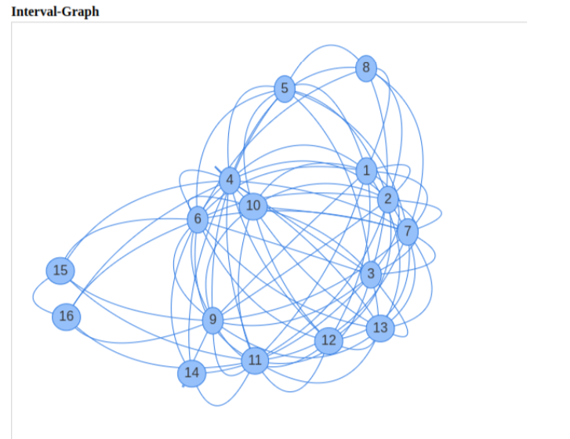
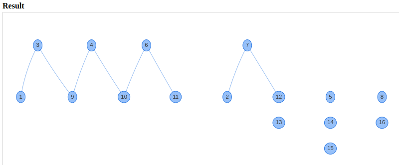

# tmp-greedy-ps

This repository contains a Java-based implementation of a greedy algorithm for solving the Train Marshalling Problem using a generalization of stable sets, called pseudochains. This concept was introduced by Dörpinghaus (2018).
 
 
In today's global economy rail freight transport plays an important role in the distribution of goods. A railroad operating system tries to optimize the transport from a source to a destination in terms of time and cost. As it is unlikely that all cars in a train share the same destination, it is necessary to rearrange them into blocks according to their destination. The rearrangement is done with a so called hump yard, which is also called marshalling yard or classification yard. The marshalling yard consists of a certain number of parallel sorting tracks. The cars of an incomming train are assigned to one of the sorting tracks. After all cars have been assigned to their distinct track, one pull-out operation places all cars of the sorting track at the end of the newly arranged train (or at the beginning of no pull-out operation has been carried out yet). Now the goal is to minimize the number of sorting tracks needed to rearrange all cars with the same destination one after the other. This optimization problem is also referred to as the Train Marshalling Problem (TMP) and was firstly introduced by Dahlhaus et. al., who also proved that the TMP is NP-complete. In the work of Beygang et al. an algorithm was introduced which partitions an interval graph into independent sets. Each inverval represents a certain destination.
 
Dörpinghaus generalized the concept of independent-sets to so called pseudochains, which are also called pseudo-independent sets or pseudo-stable sets. He introduced a greedy-type algorithm for finding a local optimum solution for the TMP using pseudochains.

## Problem definition
The needed formalisms for pseudochains and their correspondence to the Train Marshalling Problem are summarized in the work of Dörpinghaus and Schrader, which can be found [here](https://www.researchgate.net/publication/326177749_A_Graph-Theoretic_Approach_to_the_Train_Marshalling_Problem).
## Implementation
Our application is implemented using [Spring Boot](https://spring.io/projects/spring-boot). We use [vis.js](https://visjs.org/) for the visualization of the interval graph and its partition into pseudochains.
 
 
A train must be provided in CSV format or a random instance can be generated. The following example contains 50 cars with 16 destinations:
 
 
1,1,2,2,2,1,2,1,3,1,4,5,2,6,4,7,2,8,3,9,5,10,9,5,11,12,13,2,7,13,10,11,9,6,1,3,
 14,3,15,16,11,6,15,6,15,9,6,11,4,15
 
 
The interval graph of the given instance is then given by
 

 
 
The algorithm partitions the given problem instance into pseudochains, finding a local optimum solution. The solution is visualized as follows

## References

[1] Elias Dahlhaus et al. "The train marshalling problem." In: Discrete Applied Mathematics 103.1 (2000), pp. 41-54. 
[2] Jens Dörpinghaus. "Pseudostabile Mengen in Graphen." PhD thesis. University of Cologne, 2018. 
[3] Jens Dörpinghaus and Rainer Schrader. "A Graph-Theoretic Approach to the Train Marshalling Problem." In: Proceedings of the FedCSIS 11th International Workshop on Computational Optimization. 2018. 

## License
### MIT License
